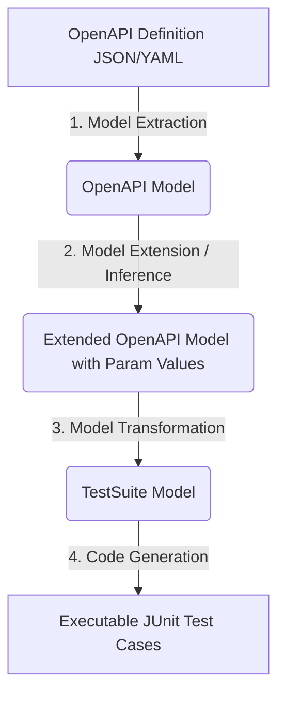

# BÁO CÁO TÓM TẮT THUẬT TOÁN
## Tự động sinh ca kiểm thử cho REST API: Tiếp cận dựa trên đặc tả (Specification-Based)

---

### I. THÔNG TIN BÀI BÁO GỐC
* **Tên bài báo:** *Automatic Generation of Test Cases for REST APIs: a Specification-Based Approach* (Tự động sinh các ca kiểm thử cho REST API: Cách tiếp cận dựa trên đặc tả).
* **Tác giả:** Hamza Ed-douibi, Javier Luis Canovas Izquierdo, Jordi Cabot.
* **Tổ chức:** Viện Nghiên cứu Liên ngành Internet (IN3), Đại học Mở Catalonia (UOC), Barcelona, Tây Ban Nha & ICREA.
* **Lĩnh vực nghiên cứu:** Kiểm thử phần mềm (Software Testing), REST API, OpenAPI/Swagger, Model-Driven Engineering (Kỹ nghệ hướng mô hình).

---

### II. ĐẶT VẤN ĐỀ & BỐI CẢNH (INTRODUCTION)
* **Sự bùng nổ của REST API:** Kiến trúc REST dựa trên giao thức HTTP và định dạng JSON đã trở thành lựa chọn hàng đầu để thiết kế Web API.
* **Thách thức trong kiểm thử:** REST không đi kèm với bất kỳ tiêu chuẩn bắt buộc nào để mô tả cách xây dựng/tiêu thụ dịch vụ, gây khó khăn cho việc tích hợp và kiểm thử tự động. 
* **Sự ra đời của các chuẩn mô tả:** Các định dạng như OpenAPI (Swagger), RAML và API Blueprint giúp chuẩn hóa tài liệu hóa API, mở ra cơ hội tự động hóa các tác vụ phát triển và kiểm thử.
* **Hạn chế của các công cụ hiện tại:**
  1. Các công cụ kiểm thử REST API tự động hiện tại (như ReadyAPI!, Dredd, Runscope, Apiary) hầu hết chỉ hỗ trợ sinh các **ca kiểm thử danh định (nominal test cases)** (sử dụng dữ liệu đúng) mà bỏ qua các **ca kiểm thử lỗi (fault-based test cases)** (sử dụng dữ liệu sai/vi phạm ràng buộc).
  2. Đòi hỏi nhà phát triển phải cấu hình thủ công hoặc cung cấp dữ liệu đầu vào (input data) rất phức tạp.
  3. Không có khả năng tự động suy diễn các ràng buộc dữ liệu một cách thông minh từ tài liệu đặc tả.

---

### III. PHƯƠNG PHÁP ĐỀ XUẤT (THE PROPOSED APPROACH)
Nghiên cứu đề xuất một quy trình tự động hóa toàn diện dựa trên kỹ nghệ hướng mô hình (Model-Driven) để sinh ra cả ca kiểm thử danh định (Nominal) và ca kiểm thử lỗi (Faulty) với độ bao phủ cao mà không cần lập trình hay cấu hình thủ công.

#### 1. Quy trình tổng quan (4 bước)
Quy trình được thực hiện tuần tự qua các bước:
1. **Model Extraction (Trích xuất mô hình):** Phân tích và chuyển đổi tệp OpenAPI đặc tả API (định dạng JSON/YAML) thành một mô hình trung gian cụ thể (OpenAPI Model) dựa trên metamodel đã định nghĩa.
2. **Model Extension (Mở rộng mô hình):** Áp dụng các luật suy diễn dữ liệu để tự động tìm kiếm/tạo ra các giá trị tham số (input data) hợp lệ và không hợp lệ, điền vào mô hình OpenAPI.
3. **Model Transformation (Biến đổi mô hình):** Chuyển đổi mô hình OpenAPI đã làm giàu dữ liệu sang mô hình ca kiểm thử (TestSuite Model) độc lập với nền tảng.
4. **Code Generation (Sinh mã nguồn):** Từ TestSuite Model, tự động sinh ra mã nguồn kiểm thử thực thi được (trong bài báo sử dụng JUnit chạy trên Java kết hợp Unirest và JSON Schema Validator).

---

### IV. KIẾN TRÚC MÔ HÌNH HÓA (METAMODELS)
Cách tiếp cận sử dụng hai Metamodel cốt lõi để đại diện cho thông tin ở dạng độc lập với nền tảng (Platform-Independent):

#### 1. OpenAPI Metamodel (Mô hình hóa đặc tả API)
* Biểu diễn cấu trúc phân cấp của đặc tả API:
  * **API:** Chứa thông tin về `host`, `basePath`, danh sách các đường dẫn (`paths`) và định nghĩa kiểu dữ liệu (`definitions`).
  * **Path:** Biểu diễn các endpoint với các phương thức HTTP tương ứng (`GET`, `POST`, `PUT`, `DELETE`).
  * **Operation:** Định nghĩa một tác vụ trên endpoint cụ thể gồm danh sách tham số (`parameters`) và phản hồi (`responses`).
  * **Parameter:** Đại diện cho tham số đầu vào, lưu trữ vị trí (`query`, `path`, `header`, `body`), kiểu dữ liệu (`type`), ràng buộc định dạng và ví dụ (`example`).
  * **Response:** Biểu diễn kết quả trả về gồm mã trạng thái HTTP (`code`), cấu trúc schema (`schema`) và ví dụ.

#### 2. TestSuite Metamodel (Mô hình hóa ca kiểm thử)
* Định nghĩa cấu trúc của một bộ kiểm thử độc lập công nghệ:
  * **TestSuite:** Tập hợp các ca kiểm thử (`testCases`) cho một API đích.
  * **TestCase:** Bao gồm chuỗi các bước kiểm thử (`testSteps`).
  * **APIRequest:** Thừa kế từ `TestStep`, chứa thông tin yêu cầu HTTP thực tế (phương thức, endpoint, tham số truyền vào, thông tin xác thực như Basic/APIKey/OAuth2) và danh sách kiểm chứng (`assertions`).
  * **Assertion (Kiểm chứng kết quả):**
    * *StatusCodeAssertion:* Kiểm tra mã trạng thái trả về (Valid - thành công 2xx, hoặc Invalid - lỗi 4xx).
    * *HeaderAssertion:* Kiểm tra sự tồn tại (`HeaderExists`) hoặc giá trị cụ thể (`HeaderEquals`) của một header trong HTTP Response.
    * *SchemaComplianceAssertion:* Kiểm tra tính hợp lệ về cấu trúc dữ liệu của payload trả về so với JSON Schema được định nghĩa trong đặc tả.

---

### V. CHI TIẾT CÁC LUẬT XỬ LÝ TRONG THUẬT TOÁN

#### 1. Suy diễn giá trị tham số (Parameter Value Inference Rules)
Để chạy các ca kiểm thử tự động, hệ thống cần dữ liệu đầu vào. Thuật toán áp dụng 3 quy tắc suy diễn (Inference Rules) theo thứ tự ưu tiên giảm dần:

* **Luật 1 (PR 1 - Simple parameter value inference):**
  Tìm kiếm các giá trị có sẵn trong tệp đặc tả theo độ ưu tiên:
  1. Thuộc tính ví dụ có sẵn: `parameter.example` hoặc `schema.example`.
  2. Giá trị mặc định: `default` hoặc `items.default` (nếu là kiểu mảng).
  3. Giá trị enum đầu tiên: phần tử đầu tiên của danh sách `enum` hoặc `items.enum`.
* **Luật 2 (PR 2 - Dummy parameter value inference):**
  Nếu không có sẵn ví dụ/mặc định, hệ thống tự động tạo ra một giá trị ngẫu nhiên (nhưng đúng kiểu dữ liệu). Sau đó, gửi thử một yêu cầu thực tế tới API; nếu phản hồi trả về mã thành công `2xx`, giá trị này được giữ lại để sử dụng.
* **Luật 3 (PR 3 - Complex parameter value inference):**
  Áp dụng cho các tham số phụ thuộc (ví dụ: cần có `petId` của một thú cưng đã tồn tại). Thuật toán sẽ tìm một thao tác đọc (`o`) có thể kiểm thử thành công trước đó (ví dụ: `findPetsByStatus`), thực hiện yêu cầu HTTP để lấy dữ liệu trả về, sau đó tìm kiếm trong kết quả (`r.schema`) thuộc tính trùng khớp với tên tham số cần điền (sử dụng heuristics so khớp tên tham số, ví dụ `petId` khớp với thuộc tính `id` của thực thể `Pet`).

> [!NOTE]
> Do luật PR2 và PR3 yêu cầu gửi yêu cầu thực tế lên server nên có thể gây ảnh hưởng đến dữ liệu (side-effects). Vì vậy:
> - Các tham số **bắt buộc (required)** được áp dụng cả 3 luật (PR1, PR2, PR3).
> - Các tham số **tùy chọn (optional)** chỉ áp dụng duy nhất luật PR1 để tránh quá tải hoặc sai lệch dữ liệu.

---

#### 2. Luật sinh ca kiểm thử danh định (Nominal Test Case Rules - GR 1)
Áp dụng khi kiểm tra hành vi đúng của API (mong đợi mã thành công `2xx`):
* Nếu một operation có thể kiểm thử (tất cả các tham số bắt buộc đều suy diễn được giá trị):
  1. Sinh ra **01 TestCase cơ bản:** Chỉ truyền các tham số bắt buộc (`required`).
  2. Sinh thêm **01 TestCase đầy đủ:** Truyền cả tham số bắt buộc lẫn các tham số tùy chọn (`optional`) có thể suy diễn được giá trị.
* **Các Assertion đi kèm:**
  * `ValidStatusCodeAssertion`: Kiểm tra HTTP code trả về thuộc nhóm `2xx`.
  * `SchemaComplianceAssertion`: So khớp cấu trúc JSON của response body với schema mô tả trong OpenAPI.
  * `HeaderExistsAssertion`: Xác minh sự tồn tại của các header được khai báo trong phản hồi thành công.

---

#### 3. Luật sinh ca kiểm thử lỗi (Faulty Test Case Rules - GR 2)
Áp dụng để kiểm thử khả năng xử lý lỗi của API (mong đợi mã lỗi client `4xx`):
Với mỗi tham số `p` trong một operation, sinh ra các ca kiểm thử vi phạm sau:

* **Thiếu tham số bắt buộc (Required missing):** Nếu `p` là bắt buộc và không nằm ở đường dẫn (`path`), sinh ca kiểm thử bằng cách bỏ trống tham số này.
* **Sai kiểu dữ liệu (Wrong data types):** Nếu tham số không phải là chuỗi (string), sinh giá trị sai kiểu theo quy tắc tại **Bảng 1**.
* **Vi phạm ràng buộc (Violated constraints):** Nếu tham số có định nghĩa các điều kiện ràng buộc trong JSON Schema, sinh giá trị phá vỡ các điều kiện đó theo quy tắc tại **Bảng 2**.

##### Bảng 1: Quy tắc sinh dữ liệu sai kiểu dữ liệu (Wrong Data Types)
| Kiểu dữ liệu tham số | Quy tắc sinh giá trị lỗi | Ví dụ minh họa |
| :--- | :--- | :--- |
| **object** | Một đối tượng vi phạm schema cấu trúc | Thiếu các trường bắt buộc trong object hoặc sai định dạng trường |
| **integer / int32** | Một chuỗi ký tự ngẫu nhiên hoặc số lớn hơn $2^{31} - 1$ | `"not_an_int"` hoặc `2147483648` |
| **integer / int64** | Một chuỗi ký tự ngẫu nhiên hoặc số lớn hơn $2^{63} - 1$ | `"not_a_long"` hoặc `9223372036854775808` |
| **number / float / double** | Một chuỗi ký tự ngẫu nhiên | `"abc"` |
| **string / date / datetime** | Một chuỗi ký tự ngẫu nhiên không đúng định dạng ngày tháng | `"2026-31-02"` hoặc `"invalid-date"` |
| **boolean** | Một chuỗi ký tự ngẫu nhiên khác với `true` và `false` | `"maybe"` |

##### Bảng 2: Quy tắc sinh dữ liệu vi phạm ràng buộc (Violated Constraints)
| Ràng buộc (Constraint) | Quy tắc sinh giá trị vi phạm |
| :--- | :--- |
| **enum** | Một chuỗi hoặc số nằm ngoài danh sách định sẵn |
| **pattern** | Một chuỗi ký tự không khớp với biểu thức chính quy (Regex) |
| **maximum / exclusiveMaximum** | Một số lớn hơn giá trị tối đa cho phép |
| **minimum / exclusiveMinimum** | Một số nhỏ hơn giá trị tối thiểu cho phép |
| **minLength** | Một chuỗi có độ dài ngắn hơn độ dài tối thiểu |
| **maxLength** | Một chuỗi có độ dài lớn hơn độ dài tối đa |
| **maxItems** | Một mảng có số lượng phần tử vượt quá giới hạn tối đa |
| **minItems** | Một mảng có số lượng phần tử ít hơn giới hạn tối thiểu |
| **uniqueItems** | Một mảng có chứa các giá trị trùng lặp |
| **multipleOf** | Một số không chia hết cho giá trị `multipleOf` |

* **Assertion đi kèm:**
  * `ValidStatusCodeAssertion`: Đảm bảo API phản hồi bằng một mã lỗi thuộc nhóm `4xx` (ví dụ `400 Bad Request`).

---

#### 4. Phân loại chế độ kiểm thử (Safe vs Unsafe mode)
Do đặc tả OpenAPI v2.0 chưa hỗ trợ định nghĩa phụ thuộc trạng thái (state dependency) giữa các thao tác (ví dụ: tạo -> sửa -> xóa), việc gửi các yêu cầu thay đổi dữ liệu có thể để lại tác dụng phụ không mong muốn. Để giải quyết, thuật toán hỗ trợ hai chế độ:
* **Safe mode (Chế độ an toàn):** Chỉ sinh ca kiểm thử cho các phương thức đọc dữ liệu (`GET`).
* **Unsafe mode (Chế độ không an toàn):** Sinh ca kiểm thử cho tất cả các phương thức (`GET`, `POST`, `PUT`, `DELETE`).

---

### VI. KẾT QUẢ THỰC NGHIỆM & ĐÁNH GIÁ (VALIDATION & RESULTS)
Nhóm nghiên cứu đã xây dựng một công cụ thực nghiệm dưới dạng Eclipse Plugin (sử dụng EMF, Java, ATL và Acceleo) và tiến hành đánh giá trên tập dữ liệu thực tế:

* **Tập dữ liệu đầu vào:** Thu thập từ *APIs.guru*, lọc ra **91 định nghĩa OpenAPI** hợp lệ thuộc 32 nhà cung cấp API khác nhau.
* **Số lượng ca kiểm thử được sinh ra:** Tổng cộng **958 ca kiểm thử** (445 nominal và 513 faulty).

#### 1. Kết quả về Độ bao phủ (Coverage - RQ1)
Độ bao phủ trung bình đạt **76.5%** trên toàn bộ các thành phần của tài liệu đặc tả, cụ thể:
* **Operations (Thao tác):** Đạt **87%** độ bao phủ tổng thể (Nominal: 82%, Faulty: 63%).
* **Parameters (Tham số):** Đạt **62%** độ bao phủ (Nominal: 51%, Faulty: 50%). Nguyên nhân chỉ số này thấp là do chỉ có 30% tham số trong thực tế được thiết lập thuộc tính bắt buộc (`required`), và nhiều tham số kiểu chuỗi (`string`) không được khai báo các ràng buộc cụ thể làm hạn chế việc sinh ca lỗi.
* **Endpoints:** Đạt **81%** độ bao phủ.
* **Definitions (Kiểu dữ liệu):** Đạt **76%** độ bao phủ.

#### 2. Kết quả phát hiện lỗi (API Failures - RQ2)
Đặc biệt, công cụ đã chỉ ra rằng **40% các API thực tế (37 trên 91 API) bị lỗi** trong quá trình chạy thử nghiệm. Các lỗi được phân nhóm như sau:

##### A. Lỗi trong ca kiểm thử danh định (Nominal Test Failures) - Chiếm phần lớn là lỗi do đặc tả API viết sai:
* **Lỗi mã trạng thái (25% số API bị lỗi):** Nhận được mã lỗi HTTP (ví dụ `4xx`, `5xx`) dù đã gửi dữ liệu hoàn toàn hợp lệ theo tài liệu.
* **Lỗi cấu trúc dữ liệu (30% số API bị lỗi):** Dữ liệu JSON phản hồi thực tế từ server không khớp với mô tả trong JSON Schema của tài liệu OpenAPI (sai định dạng trường, thiếu trường bắt buộc,...).

##### B. Lỗi trong ca kiểm thử lỗi (Faulty Test Failures) - Xuất phát từ việc cài đặt Backend kém:
* **Lỗi Server Error 500 (30% số API bị lỗi):** Khi gửi dữ liệu lỗi/sai kiểu, Server bị sập (Internal Server Error) do không bắt ngoại lệ (unhandled exception) ở Backend, thay vì phải trả về lỗi Client `400 Bad Request`.
* **Lỗi chấp nhận dữ liệu sai 2xx (55% số API bị lỗi):** Server vẫn xử lý thành công và trả về `200 OK` mặc dù dữ liệu đầu vào vi phạm nghiêm trọng các ràng buộc kiểu hoặc giá trị (thiếu kiểm duyệt đầu vào ở Backend).

---

### VII. NHẬN XÉT & HƯỚNG CẢI TIẾN
* **Điểm mạnh:**
  * Tự động hóa hoàn toàn từ phân tích đặc tả đến sinh code JUnit chạy ngay.
  * Hỗ trợ sinh ca kiểm thử lỗi (Faulty) rất mạnh mẽ dựa trên việc phân tích các ràng buộc JSON Schema.
  * Giúp phát hiện nhanh sự không đồng nhất giữa tài liệu đặc tả API và mã nguồn Backend thực tế.
* **Hạn chế:**
  * Chưa hỗ trợ xử lý triệt để sự phụ thuộc dữ liệu phức tạp giữa các API (ví dụ: phải gọi API tạo token đăng nhập trước, hoặc tạo thực thể mới lấy ID để xóa).
  * Chưa hỗ trợ OpenAPI v3.0 (tại thời điểm viết bài báo).
* **Hướng phát triển đề xuất:**
  * Sử dụng NLP (Xử lý ngôn ngữ tự nhiên) để đọc hiểu mô tả tham số bằng ngôn ngữ tự nhiên nhằm suy diễn ra các ràng buộc chưa được khai báo rõ bằng code.
  * Mở rộng hỗ trợ OpenAPI v3.0, tận dụng cơ chế `links` để tự động hóa chuỗi kiểm thử liên kết (Integrative/Scenario-based Testing).
